<br>

---

<br>

```
$ ./status.sh
> status: BUILDING
> role:   FOUNDER
> age:    16
> focus:  building a company, learning everything
```

<br>

```
$ cat mission.txt

Building products that matter.
Founder at 16. Hacking code, business, and life.
Shipping constantly. Learning in public.
```

<br>

```
$ ./focus --list

  [ACTIVE]  Building my company from scratch
  [ACTIVE]  Mastering TypeScript · Python · AI · Product
  [ACTIVE]  Learning entrepreneurship by doing
  [ACTIVE]  Shipping real products every week
```

<br>

```
$ neofetch

OS:        Entrepreneur OS v1.0
Host:      atpaawej
Kernel:    TypeScript 5.x
Uptime:    16 years in progress
Packages:  React · Next.js · Node.js · Tailwind · MongoDB · PostgreSQL
Shell:     bash / zsh
Terminal:  VS Code
DE:       Building In Public
```

<br>

```
$ ls /skills/

languages/   TypeScript  JavaScript  Python  HTML  CSS
frontend/    React  Next.js  Tailwind
backend/     Node.js  Express  PostgreSQL  MongoDB
tools/       Git  VS Code  Vercel  Figma  Docker
learning/    AI/ML  System Design  Product Strategy
```

<br>

```
$ ./metrics.sh
```

<div align="center">
  <picture>
    <source media="(prefers-color-scheme: dark)" srcset="https://github-readme-stats.vercel.app/api?username=atpaawej&show_icons=true&theme=chartreuse-dark&hide_border=true&bg_color=0a0a0a&title_color=00ff41&icon_color=00ff41&text_color=00cc33">
    
  </picture>
  <picture>
    <source media="(prefers-color-scheme: dark)" srcset="https://streak-stats.demolab.com?user=atpaawej&theme=chartreuse-dark&hide_border=true&background=0a0a0a&ring=00ff41&fire=00ff41&currStreakLabel=00ff41">
    
  </picture>
  <picture>
    <source media="(prefers-color-scheme: dark)" srcset="https://github-readme-stats.vercel.app/api/top-langs/?username=atpaawej&layout=compact&theme=chartreuse-dark&hide_border=true&bg_color=0a0a0a&title_color=00ff41&text_color=00cc33">
    
  </picture>
</div>

<br>

```
$ cat contacts.txt

X:         @AawejPathan786
Instagram: @aawejpathan.786
Web:       https://aawej.in
Email:     atpaawej@gmail.com
```

<br>

```
$ echo "BUILDING IN PUBLIC"
BUILDING IN PUBLIC

$ date
2026

$ exit
```

<br>

<p align="center">
  <sub></sub>
</p>
